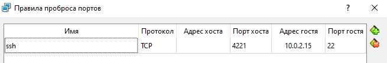

# Задание 1

1. Для начала установим 3 виртуальные машины


2. Далее переименуем *hostname* на *ivanchevserver* следующим образом:

```shell
 $ sudo hostnamectl set-hostname ivanchev_server 
```


3. С помощью команды ``` $ sudo adduser ivanchev_1 ``` создим нового пользователя ivanchev_1


Проделываем тоже самое с другими линукс системами

* с hostname: ivanchev_gateway, ivanchev_client
* c user: ivanchev_2, ivanchev_3


4. Для удобной работы создадим SSH соединение на каждой из машин


``` $ sudo apt update ```


Установим SSH с помощью команды:
``` $ sudo apt-get install ssh```


Установим OpenSSH:
``` $ sudo apt install openssh-server ```

Добавим пакет SSH-сервера в автозагрузку:

```shell
 $ sudo apt install openssh-server -y 

 $ systemctl enable ssh 

 $ systemctl start ssh 

 $ systemctl status ssh 
 ```


5. Для работы по ssh с виртуальными машинами настроим проброс портов для каждой машины.



Для ivanchev_1 - порт 4221

Для ivanchev_2 - порт 4222

Для ivanchev_3 - порт 4223

6. Следующим образом подключаемся к виртуальной машине по SSH 

```shell
$ ssh -p 4221 ivanchev_1@localhost 
```


7. Сконфигурируем виртуальные интерфейсы. Для этого воспользуемся netplan.

Установим

``` $ sudo apt-get install netplan.io ```

Но при попытки использования утилиты с пользователя ivanchev_1 нам отказали в доступе, поэтому добавил пользователя к sudo

``` $ sudo adduser ivanchev_1 sudo ```

Найдем файл конфигурации сетевого интерфейса

``` $ cd /etc/netplan/ ```

``` $ ls ```

Нашли единственный созданный файл: 00-installer-config.yaml

Начнем конфигурацию

``` $ sudo nano 00-installer-config.yaml ```


Получилось следующее


Проверим конфигурацию на ошибки

``` $ sudo netplan --debug generate ```


Ошибок нет, поэтому его можно аплаить

``` $ sudo netplan apply ```

Проверим получившиеся интерфейсы

``` $ ip a ```


Для шлюза мы создадим 2 интерфейса.


8. Перейдем к насторойке firewall с помощью iptables

Команда для пропуска пакетов через порт 5000

```shell
$ sudo iptables -A FORWARD -i enp0s9 -o enp0s8 -p tcp --syn --dport 5000 -m conntrack --ctstate NEW -j ACCEPT 
```

Команды для пробрасывания пакетов

```shell
$ sudo iptables -A FORWARD -i enp0s8 -o enp0s9 -m conntrack --ctstate ESTABLISHED,RELATED -j ACCEPT 
$ sudo iptables -A FORWARD -i enp0s9 -o enp0s8 -m conntrack --ctstate ESTABLISHED,RELATED -j ACCEPT
```

Команда для блокирования всех остальных пакетов

```shell
$ sudo iptables -P FORWARD DROP 
```

Сохраненим полученные правила

```shell 
$ sudo apt-get install iptables-persistent 
$ sudo netfilter-persistent save 
```

Вот что получилось


Разрешим переброс пакетов ip в нашем gateway с помощью команды

```shell
$ echo 1 | sudo tee /proc/sys/net/ipv4/ip_forward 1 
```

И для автоматического конфигурирования разкоментируем строчку отвечающую за это в файле /etc/sysctl.conf

sudo nano /etc/sysctl.conf


Для контроля поступающих запросов используем tcpdump

```shell
$ sudo tcpdump -i enp0s8 icmp 
```

Если хочу проверять запросы от клиента то надо поменять на enp0s9

Также можно проверять не только icmp пакеты (которые отправляются при команде ping), но и tcp заменив icmp на tcp.

Пинганул к шлюзу - пинганулся, к клиенту не пинганулся, значит все верно


9. Создадим http сервер

Используем для этого flask

```shell
 $ sudo apt install python3-pip 
 $ pip install flask 
```

Создадим директорию для сервера

```shell
 $ sudo mkdir /server 
 $ cd /server 
 ```

И создадим в файле app.py ендпойнты для тестирования http запросов

Запустим сервер

```shell
$ python3 app.py 
```

Если клиент отправляет следующую команду ``` $ curl -X POST http://192.168.5.10:5000/ ```, то
запрос приходит, но обычные пинги не пропускаются


Или разница в отправлении запроса на порт 5000 и на порт 5001


P.S. Проснулся и решил, что пора делать сервер не на этом мини тестовом фласке, а загрузить приложение, которое я разработал на шарпах.

Начал с переноса сборки на сервеную машину

```shell
$ scp -P 4221 -r ./publish/ ivanchev_1@localhost:/home/ivanchev_1/server
```

Затем установил сдк (не без проблем)

```shell
$ sudo snap install dotnet-sdk --classic --channel=5.0
```

Теперь можно запускать с помощью следующей команды

```shell
$ dotnet RestApi.dll
```

На самом деле нельзя, потому что не установлен postgres который нужен для работы приложения

```shell
$ sudo apt-get install wget ca-certificates
$ wget --quiet -O - https://www.postgresql.org/media/keys/ACCC4CF8.asc | sudo apt-key add -
$ sudo sh -c 'echo "deb http://apt.postgresql.org/pub/repos/apt/ `lsb_release -cs`-pgdg main" >> /etc/apt/sources.list.d/pgdg.list'
$ sudo apt-get update
$ sudo apt-get install postgresql postgresql-contrib
```

Но не все так просто, ведь далее при попытке запустить дллку с сервером, возникала ошибка. Смотря на все мои записи команд я не могу точно восстановить что я делал, но для начала я проверил что мое приложение правда создала бд и пользователя к нему. 

```shell
$ pgrep -u postgres -fa -- -D
$ sed -n 4p /var/lib/postgresql/14/main/postmaster.pid
```

Информация совпадает, порт тоже.

Решил запустить сам сервер

```shell
$ pg_lsclusters
$ sudo systemctl start postgresql@14-main
```

И зайдя как пользователь постгреса посмотрел информацию

```shell
$ sudo -i -u postgres
# psql
# \conninfo
```

В информации не было ничего что я бы не знал

С помощью следующей команды я смог не каждый раз запускать приложение, а проверять могу ли я подключится к серверу сам. 

```shell
$ psql -U postgres -d studentdb -h 127.0.0.1 -W
```

Главная проблема в том, что мое приложение само создает бд и подключает к ней пользователя по паролю. Но ошибка выводила, что пароль не подходит, и я просто отбросил то, что проблема правда с паролями. Много чего пытался: так как решил что проблема с адресами и портами тыкался в netplanе попутно меняя настройки моего приложения через appsettings.json. Даже попытался присоеденить внешнюю виндовскую посгрес базу, но все тсчетно, поэтому вернул все.

Решил что пора менять пароль на сервере (кажется вот это гений, но там было правда непонятно)

```shell
$ sudo -i -u postgres
$ psql -c "ALTER USER postgres WITH PASSWORD '1111'" -d studentdb
```

Ура, это все решило, и сервер наконец-то заработал


Но запросы не доходили. И проблема была не только в том что я не аплайнул netplan после его модификации для установки дотнетовского сдк, и даже не в нашем шлюзе (хотя он всегда был виновником этого).

После некоторых тестов я понял что приложение было настроено на адрес https://localhost:5001. Я изменил код проги чтобы порт был 5000, но проблема оказалась в подключенном мной редиректом на безопасное подлючение, который я тоже вырубил. Чтож теперь запросы с сервера на сервер приходили, но все же с клиента они не добирались. Ну в общем дело было в том что я использовал localhost, поэтому я снова пересобрал прогу только теперь с адресом 0.0.0.0. 


Теперь все настроено и работает


Для работы с базой данных для каждой из сущностей (студент, лектор, лекция, домашняя работа) есть CRUD операции. Для проверки запросов создадим файл testReuests.sh c GET POST PUT DELETE запросами

```shell
cd /home/ivanchev_3
sudo nano testReuests.sh
```

```shell
sudo chmod +x testReuests.sh
bash testReuests.sh
```


При выпонении файла выводятся (в json формате) сначала все лекторы, далее лексторы с четвертым новым лектором, далее с модифицированным первым лектором и далее с удаленным четвертым.


Далее с помощью systemd необходимо создадим сервис, который запускает скрипт через автозагрузку

``` $ sudo nano /lib/systemd/system/web-server.service ```


Перезапустим службы и активировать автозагрузку

```shell 
$ sudo systemctl daemon-reload
$ sudo systemctl start web-server
$ sudo systemctl enable web-server
$ sudo systemctl status web-server
```


Теперь можно просто включать виртуальную машину сервера, и от нее будут поступать ответы

10. Скачаем файл с виртуальной машины.

```shell 
$ scp -P 4221 ivanchev_1@localhost:/server/app.py app.py 

$ scp -P 4221 ivanchev_1@localhost:/etc/netplan/00-installer-config.yaml 00-installer-config.yaml 
```

P.S. Пересобрал приложение на линукс. Теперь файл запускается так: ``` $ ./RestApi ```, поэтому и поменял и файл автозапуска.

