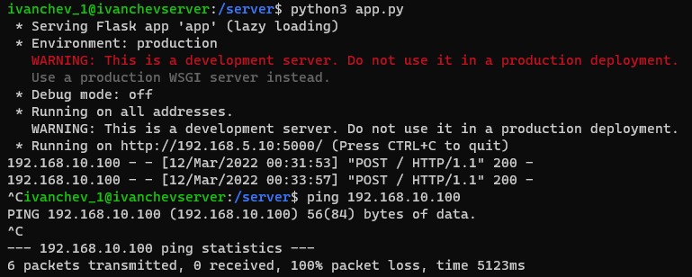

# Задание 1

1. Для начала установим 3 виртуальные машины


2. Далее переименуем *hostname* на *ivanchevserver* следующим образом:

``` $ sudo hostnamectl set-hostname ivanchev_server ```


3. С помощью команды ``` $ sudo adduser ivanchev_1 ``` создим нового пользователя ivanchev_1


Проделываем тоже самое с другими линукс системами

* с hostname: ivanchev_gateway, ivanchev_client
* c user: ivanchev_2, ivanchev_3


4. Для удобной работы создадим SSH соединение на каждой из машин


``` $ sudo apt update ```


Установим SSH с помощью команды:
``` $ sudo apt-get install ssh```


Установим OpenSSH:
``` $ sudo apt install openssh-server ```

Добавим пакет SSH-сервера в автозагрузку:

``` $ sudo apt install openssh-server -y ```

``` $ systemctl enable ssh ```

``` $ systemctl start ssh ```

``` $ systemctl status ssh ```


5. Для работы по ssh с виртуальными машинами настроим проброс портов для каждой машины.


Для ivanchev_1 - порт 4221

Для ivanchev_2 - порт 4222

Для ivanchev_3 - порт 4223

6. Следующим образом подключаемся к виртуальной машине по SSH 

``` $ ssh -p 4221 ivanchev_1@localhost ```


7. Сконфигурируем виртуальные интерфейсы. Для этого воспользуемся netplan.

Установим

``` $ sudo apt-get install netplan.io ```

Но при попытки использования утилиты с пользователя ivanchev_1 нам отказали в доступе, поэтому добавил пользователя к sudo

``` $ sudo adduser ivanchev_1 sudo ```

Найдем файл конфигурации сетевого интерфейса

``` $ cd /etc/netplan/ ```

``` $ ls ```

Нашли единственный созданный файл: 00-installer-config.yaml

Начнем конфигурацию

``` $ sudo nano 00-installer-config.yaml ```


Получилось следующее


Проверим конфигурацию на ошибки

``` $ sudo netplan --debug generate ```


Ошибок нет, поэтому его можно аплаить

``` $ sudo netplan apply ```

Проверим получившиеся интерфейсы

``` $ ip a ```


Для нашего шлюза мы создадим 2 интерфейса.


8. Перейдем к насторойке firewall с помощью iptables

Команда для пропуска пакетов через порт 5000

``` $ sudo iptables -A FORWARD -i enp0s9 -o enp0s8 -p tcp --syn --dport 5000 -m conntrack --ctstate NEW -j ACCEPT ```

Команды для блокирования всех остальных пакетов

``` $ sudo iptables -A FORWARD -i enp0s8 -o enp0s9 -m conntrack --ctstate ESTABLISHED,RELATED -j ACCEPT ```
``` $ sudo iptables -A FORWARD -i enp0s9 -o enp0s8 -m conntrack --ctstate ESTABLISHED,RELATED -j ACCEPT ```
``` $ sudo iptables -P FORWARD DROP ```

Сохранение полученные правила

``` $ sudo apt-get install iptables-persistent ```
``` $ sudo netfilter-persistent save ```

Вот что получилось


Для контроля поступающих запросов используем tcpdump

``` $ sudo tcpdump -i enp0s8 icmp ```

если хочу проверять запросы от клиента то надо поменять на enp0s9


Пинганул к шлюзу - пинганулся, к клиенту не пинганулся, значит все верно


9. Создадим http сервер

Используем для этого flask

``` $ sudo apt install python3-pip ```
``` $ pip install flask ```

Создадим директорию для сервера

``` $ sudo mkdir /server ```

``` $ cd /server ```

И создадим что-то для тестирования http запросов

Запустим сервер

``` $ python3 app.py ```

Если клиент отправляет следующую команду ``` $ curl -X POST http://192.168.5.10:5000/ ```, то
запрос приходит, но обычные пинги не пропускаются



10. Скачаем файл с виртуальной машины.

``` $ scp -P 4221 ivanchev_1@localhost:/server/app.py app.py ```

``` $ scp -P 4221 ivanchev_1@localhost:/etc/netplan/00-installer-config.yaml 00-installer-config.yaml ```